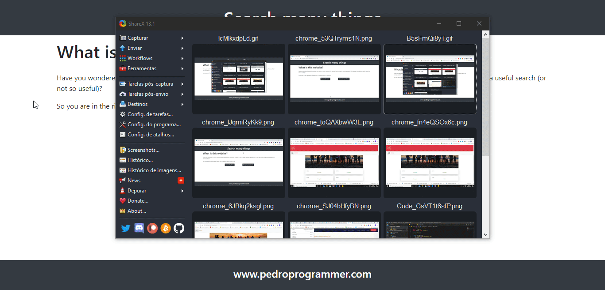

# useFetch examples

A web app that consumes a few third pard API with my custom React Hook.
The propose of this web app is to show to others web developers how to use my hook and test him against several different third pard API to make this tool more robust. 

**[Try it here](https://enigmatic-plateau-62419.herokuapp.com/)**

And useFetch repo is [here](https://github.com/PedroMarianoAlmeida/useFech-react-hook)

# Tech Stack
- React
    - Hooks (useState, useEffect and **useFetch**)
    - React Router (for navegation)
    - Bootstrap (all style and diagramming)
    - Bootstrap - React (modal Component)
- [Nationalize API](https://nationalize.io/) (given a name list, returns in which countries this name is more common)
- [Spoonacular API](https://spoonacular.com/food-api) (given a ingredient list, returns recipies with this ingredients)
- Heroku (host and deploy)

# Run Locally
1. Clone this repo
1. Open terminal and execute `npm start`
1. Have fun!
